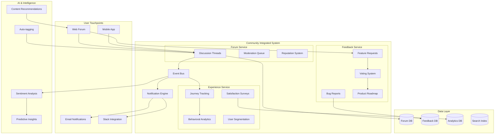
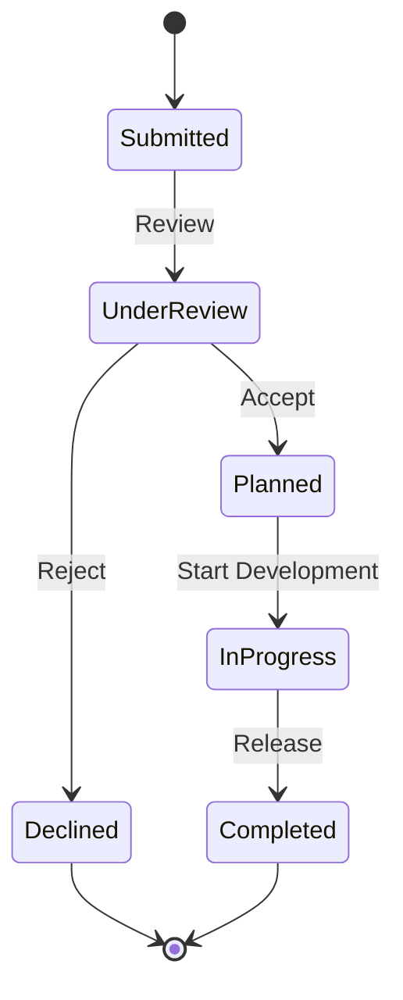

# Community Integrated System

Customer engagement platform combining support forums, product feedback loops, and customer experience tracking into a unified community ecosystem.

## Overview

The Community Integrated System merges three customer-facing system architects:

- **Support System Architect (Forums)**: Community forums, discussion boards, peer-to-peer support
- **Product System Architect (Feedback)**: Feature requests, bug reports, product roadmap voting
- **Customer Experience System Architect**: User journey tracking, satisfaction metrics, lifecycle management

## Architecture Diagram



## Tech Stack

### Core Platform
- **Forum Engine**: Discourse / Flarum / Custom Node.js
- **Backend**: Node.js 20 / Python 3.11 with FastAPI
- **API**: GraphQL + REST
- **Real-time**: WebSockets (Socket.io) for live updates

### Data & Search
- **Database**: PostgreSQL 15 for structured data
- **Time-Series**: TimescaleDB for journey tracking
- **Search**: Elasticsearch 8 for forum search
- **Cache**: Redis 7 for sessions and real-time data

### AI & ML
- **Sentiment Analysis**: Hugging Face Transformers
- **Auto-tagging**: OpenAI GPT-4 / Custom NLP
- **Recommendations**: Collaborative filtering with TensorFlow
- **Insights**: Python ML pipeline with scikit-learn

### Integration & Notifications
- **Message Queue**: RabbitMQ / Apache Kafka
- **Email**: SendGrid / AWS SES
- **Push Notifications**: Firebase Cloud Messaging
- **Webhooks**: Custom webhook delivery system

## Key Features

### 1. Community Forums

**Discussion Management**
- Threaded discussions with nested replies
- Rich text editor with markdown support
- File attachments and media embedding
- @mentions and notifications
- Topic categories and tags

**Moderation Tools**
```yaml
Moderation Features:
  - Auto-moderation with keyword filters
  - Flagging and reporting system
  - Moderator queue and dashboard
  - User warnings and suspensions
  - Content approval workflows
```

**Reputation System**
- Karma points for helpful contributions
- Badges and achievements
- Trust levels (0-4) with increasing privileges
- Leaderboards and gamification

### 2. Product Feedback

**Feature Request Management**


**Voting System**
- Upvote/downvote with weighted scoring
- Vote allocation limits per user
- Trending algorithm based on velocity
- Public roadmap with voted features

**Bug Tracking Integration**
- Automatic Jira/Linear sync
- Status updates from dev team
- Release notes generation
- Impact assessment

### 3. Customer Experience Tracking

**Journey Analytics**
```typescript
interface UserJourney {
  userId: string;
  touchpoints: Touchpoint[];
  milestones: Milestone[];
  healthScore: number;
  churnRisk: number;
  lifetimeValue: number;
}

interface Touchpoint {
  type: 'forum_post' | 'feedback' | 'support_ticket' | 'purchase';
  timestamp: Date;
  sentiment: number;
  metadata: Record<string, any>;
}
```

**Satisfaction Metrics**
- NPS (Net Promoter Score) surveys
- CSAT (Customer Satisfaction) tracking
- CES (Customer Effort Score) measurement
- In-app feedback collection

**Predictive Analytics**
- Churn prediction models
- Engagement forecasting
- Feature adoption rates
- Cohort analysis

## API Contracts

### Forum API

```graphql
# Query forum discussions
query GetDiscussions($category: String, $limit: Int) {
  forum {
    discussions(category: $category, limit: $limit) {
      id
      title
      author {
        username
        reputation
        badges
      }
      content
      replies {
        count
        latest {
          author
          content
          createdAt
        }
      }
      views
      likes
      tags
      createdAt
    }
  }
}

# Create discussion
mutation CreateDiscussion($input: DiscussionInput!) {
  forum {
    createDiscussion(input: $input) {
      id
      url
      status
    }
  }
}

# Moderate content
mutation ModeratePost($postId: ID!, $action: ModerationAction!) {
  forum {
    moderatePost(postId: $postId, action: $action) {
      success
      reason
    }
  }
}
```

### Feedback API

```graphql
# Query feature requests
query GetFeatureRequests($sort: FeedbackSort) {
  feedback {
    features(sort: $sort) {
      id
      title
      description
      author
      votes
      status
      category
      roadmapEta
      comments {
        count
      }
    }
  }
}

# Submit feature request
mutation SubmitFeature($input: FeatureInput!) {
  feedback {
    submitFeature(input: $input) {
      id
      votingUrl
    }
  }
}

# Vote on feature
mutation VoteFeature($featureId: ID!, $vote: VoteType!) {
  feedback {
    vote(featureId: $featureId, vote: $vote) {
      newScore
      userVotesRemaining
    }
  }
}
```

### Experience API

```graphql
# Track user event
mutation TrackEvent($event: EventInput!) {
  experience {
    trackEvent(event: $event) {
      success
      journeyUpdated
    }
  }
}

# Get user health score
query GetUserHealth($userId: ID!) {
  experience {
    userHealth(userId: $userId) {
      healthScore
      churnRisk
      engagementLevel
      lastActivity
      insights {
        type
        description
        recommendation
      }
    }
  }
}

# Send satisfaction survey
mutation SendSurvey($userId: ID!, $type: SurveyType!) {
  experience {
    sendSurvey(userId: $userId, type: $type) {
      surveyId
      deliveryStatus
    }
  }
}
```

## Integration Points

### Internal Systems

| System | Integration | Purpose |
|--------|-------------|---------|
| Support System | Deep Integration | Forum threads linked to support tickets |
| Marketplace | API | Product feedback for purchased items |
| Marketing | Event Stream | Customer insights for campaigns |
| Product Team | Webhook | Feature requests to roadmap |
| Content System | Embedded | Knowledge base in forum |

### External Services

| Service | Purpose |
|---------|---------|
| Slack | Team notifications for high-priority issues |
| Discord | Alternative community platform |
| Intercom | Support chat integration |
| Segment | Customer data platform |
| Mixpanel | Advanced analytics |
| Zendesk | Support ticket sync |

## Performance Targets

| Metric | Target | Current |
|--------|--------|---------|
| Forum Page Load | < 1s | 850ms |
| API Response Time | < 150ms | 120ms |
| Search Latency | < 200ms | 180ms |
| Real-time Updates | < 100ms | 75ms |
| Notification Delivery | < 5s | 3s |

## AI-Powered Features

### Sentiment Analysis
```python
from transformers import pipeline

sentiment_analyzer = pipeline("sentiment-analysis", 
                             model="distilbert-base-uncased-finetuned-sst-2-english")

def analyze_post_sentiment(text: str) -> dict:
    result = sentiment_analyzer(text[:512])[0]
    return {
        "sentiment": result["label"],
        "confidence": result["score"],
        "needs_attention": result["label"] == "NEGATIVE" and result["score"] > 0.9
    }
```

### Auto-Tagging
```typescript
async function autoTagContent(content: string): Promise<string[]> {
  const response = await openai.chat.completions.create({
    model: "gpt-4",
    messages: [{
      role: "system",
      content: "Extract relevant tags from this forum post. Return 3-5 tags."
    }, {
      role: "user",
      content: content
    }],
    max_tokens: 50
  });
  
  return response.choices[0].message.content.split(',').map(t => t.trim());
}
```

### Churn Prediction
```python
import numpy as np
from sklearn.ensemble import RandomForestClassifier

class ChurnPredictor:
    def __init__(self):
        self.model = RandomForestClassifier(n_estimators=100)
    
    def predict_churn(self, user_features: dict) -> dict:
        # Features: days_since_last_activity, forum_posts, feedback_submissions,
        # support_tickets, sentiment_avg, engagement_score
        features = np.array([[
            user_features['days_since_last_activity'],
            user_features['forum_posts'],
            user_features['feedback_submissions'],
            user_features['support_tickets'],
            user_features['sentiment_avg'],
            user_features['engagement_score']
        ]])
        
        churn_probability = self.model.predict_proba(features)[0][1]
        
        return {
            "churn_risk": churn_probability,
            "risk_level": "high" if churn_probability > 0.7 else "medium" if churn_probability > 0.4 else "low",
            "recommended_actions": self._get_retention_actions(churn_probability)
        }
    
    def _get_retention_actions(self, risk: float) -> list:
        if risk > 0.7:
            return ["immediate_outreach", "offer_incentive", "assign_success_manager"]
        elif risk > 0.4:
            return ["send_survey", "highlight_new_features", "invite_to_webinar"]
        return ["continue_monitoring"]
```

## Deployment

### Development
```bash
docker-compose up -d
# Services:
# - Forum: http://localhost:3000
# - Feedback: http://localhost:3001
# - Experience API: http://localhost:3002
# - Analytics Dashboard: http://localhost:8080
```

### Production
```yaml
# Kubernetes deployment
apiVersion: apps/v1
kind: Deployment
metadata:
  name: community-forum
spec:
  replicas: 5
  selector:
    matchLabels:
      app: forum
  template:
    metadata:
      labels:
        app: forum
    spec:
      containers:
      - name: forum
        image: ionoi/community-forum:latest
        resources:
          requests:
            memory: "512Mi"
            cpu: "500m"
          limits:
            memory: "1Gi"
            cpu: "1000m"
```

## Getting Started

### Prerequisites
- Docker & Docker Compose
- Node.js 20 LTS
- Python 3.11+
- PostgreSQL 15+
- Redis 7+

### Local Setup

```bash
# Clone repository
git clone https://github.com/dutchiono/community-integrated-system.git
cd community-integrated-system

# Install dependencies
npm install
pip install -r requirements.txt

# Set up environment
cp .env.example .env

# Start services
docker-compose up -d

# Run migrations
npm run migrate

# Start development servers
npm run dev:forum &
npm run dev:feedback &
python -m uvicorn experience:app --reload
```

## Contributing

See [CONTRIBUTING.md](./CONTRIBUTING.md) for:
- Community guidelines
- Code standards
- Testing requirements
- Pull request process

## License

MIT License - See [LICENSE](./LICENSE)

## Support

- Documentation: [docs.ionoi.io/community](https://docs.ionoi.io/community)
- Forum: [community.ionoi.io](https://community.ionoi.io)
- Issues: [GitHub Issues](https://github.com/dutchiono/community-integrated-system/issues)
- Email: community@ionoi.io
